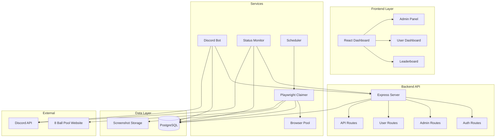

# 🎱 8 Ball Pool Rewards System

<div align="center">


**Automated Daily Rewards Claiming System for 8 Ball Pool**

[](https://nodejs.org/)
[](https://www.typescriptlang.org/)
[](https://reactjs.org/)
[](https://www.postgresql.org/)
[](https://discord.com/)
[](https://www.docker.com/)
[](LICENSE)

**A production-ready, full-stack automation platform for managing daily rewards claims**

[Features](#-key-features) • [Quick Start](#-quick-start) • [Documentation](#-documentation) • [Configuration](#-configuration)

</div>

---

## 📋 Table of Contents

- [Overview](#-overview)
- [Key Features](#-key-features)
- [System Architecture](#-system-architecture)
- [Quick Start](#-quick-start)
- [Configuration](#-configuration)
- [Documentation](#-documentation)
- [Technical Stack](#-technical-stack)
- [Deployment](#-deployment)
- [Security](#-security)
- [Contributing](#-contributing)
- [License](#-license)
- [Author](#-author)

---

## 🎯 Overview

The **8 Ball Pool Rewards System** is a comprehensive, production-ready automation platform designed to automatically claim daily rewards for registered users on the 8 Ball Pool website. Built with modern technologies and best practices, it provides a complete solution including web dashboards, Discord bot integration, automated scheduling, duplicate detection, and comprehensive monitoring.

### What This System Does

- 🤖 **Automates Daily Claims** - Runs scheduled claims for all registered users automatically
- 📊 **Web Dashboard** - Beautiful React-based interface for users and admins
- 🔔 **Discord Integration** - Full bot integration for user management and notifications
- 🛡️ **Multi-Layer Protection** - Advanced duplicate detection and validation systems
- 📸 **Visual Confirmation** - Screenshot capture for every claim attempt
- 📈 **Analytics & Reporting** - Comprehensive statistics and leaderboards
- 🔐 **Secure Authentication** - Discord OAuth and role-based access control
- 🐳 **Docker Ready** - Complete containerization for easy deployment

---

## ✨ Key Features

### 🤖 Automation & Scheduling
- **Automated Daily Claims** - Configurable cron-based scheduling
- **Manual Trigger Support** - Admin can trigger claims on-demand
- **Browser Pool Management** - Concurrent browser automation with Playwright
- **Smart Retry Logic** - Automatic retry for failed claims
- **Resource Optimisation** - Efficient browser pool management

### 📊 Dashboard & Analytics
- **Public Leaderboard** - Real-time rankings and statistics
- **User Dashboard** - Personal claim history and statistics
- **Admin Dashboard** - Complete system management interface
- **Real-time Metrics** - Live system monitoring and health checks
- **Screenshot Gallery** - Visual proof of all claim attempts
- **Analytics Dashboard** - Success rates, trends, and detailed reporting

### 🔔 Discord Integration
- **User Registration** - Register via Discord bot commands
- **Status Notifications** - Real-time claim status updates
- **Admin Commands** - Full administrative control via Discord
- **Status Monitor Bot** - Separate bot for system health monitoring
- **Channel Management** - Automated message posting and cleanup

### 🛡️ Security & Protection
- **4-Layer Duplicate Detection** - Database, webpage state, validation, and API-level protection
- **Discord OAuth** - Secure authentication via Discord
- **Role-Based Access Control** - Admin, VPS Owner, and user roles
- **Session Management** - Secure JWT-based sessions
- **Rate Limiting** - API protection against abuse
- **Input Validation** - Comprehensive sanitisation and validation

### 🔧 Advanced Features
- **Verification Bot Integration** - Optional integration with verification system
- **Email Notifications** - SMTP support for admin alerts
- **Telegram Integration** - Optional Telegram bot for notifications
- **VPS Terminal Access** - Secure server access for authorized users
- **Service Monitoring** - Health checks and automatic alerting
- **Database Consolidation** - Unified PostgreSQL database architecture

---

## 🏗️ System Architecture



### Core Components

| Component | Technology | Description |
|-----------|------------|-------------|
| **Frontend** | React 18 + TypeScript | Modern, responsive web interface with Tailwind CSS |
| **Backend API** | Node.js + Express + TypeScript | RESTful API with comprehensive routing |
| **Database** | PostgreSQL 14+ | Primary data store with optimised indexes |
| **Automation** | Playwright | Headless browser automation for claims |
| **Discord Bot** | Discord.js | User management and notifications |
| **Status Monitor** | Discord.js | System health monitoring and alerts |
| **Scheduler** | node-cron | Automated task scheduling |
| **Containerisation** | Docker + Docker Compose | Complete containerised deployment |

---

## 🚀 Quick Start

### Prerequisites

- **Node.js** 18+ ([Download](https://nodejs.org/))
- **PostgreSQL** 14+ ([Download](https://www.postgresql.org/download/))
- **Docker** (optional, for containerized deployment)
- **Discord Bot Token** ([Get from Discord Developer Portal](https://discord.com/developers/applications))

### Installation Steps

#### 1. Clone the Repository

```bash
git clone https://github.com/BlakeMcBride1625/8bp-rewards-5.0-Public.git
cd 8bp-rewards-5.0-Public
```

#### 2. Install Dependencies

```bash
# Install root dependencies
npm install

# Install frontend dependencies
cd frontend && npm install && cd ..
```

#### 3. Configure Environment

```bash
# Copy the example environment file
cp .env.example .env

# Edit .env with your configuration
# See Configuration section below for details
nano .env  # or use your preferred editor
```

#### 4. Database Setup

**Option A: Docker (Recommended)**
```bash
# Start PostgreSQL container
docker-compose up -d postgres

# Run migrations
psql -h localhost -U postgres -f scripts/init-postgres.sql
```

**Option B: Local PostgreSQL**
```bash
# Create database
sudo -u postgres psql
CREATE DATABASE 8bp_rewards;
CREATE USER your_username WITH PASSWORD 'your_password';
GRANT ALL PRIVILEGES ON DATABASE 8bp_rewards TO your_username;
\q

# Run migrations
psql -U your_username -d 8bp_rewards -f scripts/init-postgres.sql
```

#### 5. Build and Start

**Development Mode:**
```bash
npm run dev
```

**Production Mode:**
```bash
npm run build
npm start
```

**Docker Deployment:**
```bash
docker-compose up -d
```

---

## ⚙️ Configuration

### Environment Variables

The system uses a comprehensive `.env` file for configuration. A complete example is provided in `.env.example` with detailed comments explaining each variable.

#### Quick Configuration Guide

**Essential Variables (Required):**
```env
# Database
POSTGRES_HOST=localhost
POSTGRES_PORT=5432
POSTGRES_DB=8bp_rewards
POSTGRES_USER=your_username
POSTGRES_PASSWORD=your_password

# Discord Bot
DISCORD_TOKEN=your_discord_bot_token
DISCORD_CLIENT_ID=your_discord_client_id
DISCORD_CLIENT_SECRET=your_discord_client_secret
DISCORD_GUILD_ID=your_guild_id

# Security
JWT_SECRET=generate_strong_random_string
SESSION_SECRET=generate_strong_random_string
```

**Optional but Recommended:**
```env
# Public URLs
PUBLIC_URL=https://yourdomain.com
OAUTH_REDIRECT_URI=https://yourdomain.com/api/auth/discord/callback

# Admin Access
ALLOWED_ADMINS=discord_id1,discord_id2
VPS_OWNERS=discord_id1,discord_id2

# Email (for admin alerts)
SMTP_HOST=smtp.gmail.com
SMTP_PORT=587
SMTP_USER=your_email@gmail.com
SMTP_PASS=your_app_password
```

### Configuration Categories

The `.env.example` file is organized into clear sections:

1. **Environment Configuration** - Node environment and timezone
2. **Primary Database** - PostgreSQL connection settings
3. **Legacy Database** - MongoDB (for archival use)
4. **Server Ports** - All service port configurations
5. **Discord Bot (Main)** - Main rewards bot configuration
6. **Discord Bot (Status Monitor)** - Health monitoring bot
7. **Telegram Bot** - Optional Telegram integration
8. **User Mappings & Emails** - Admin email and user mappings
9. **Frontend/React Config** - Public URLs and social links
10. **Authentication/Security** - JWT and session secrets
11. **Email/SMTP** - Email notification configuration
12. **Verification Bot** - Optional verification system integration
13. **OpenAI** - OCR configuration for verification
14. **Legacy Settings** - Backward compatibility settings

**📝 See `.env.example` for complete configuration reference with detailed comments.**

### Generating Secrets

```bash
# Generate JWT Secret
openssl rand -base64 32

# Generate Session Secret
openssl rand -hex 32
```

---

## 📚 Documentation

Comprehensive documentation is available in the [`docs/`](./docs/) directory:

### Getting Started
- **[START_HERE.md](./docs/START_HERE.md)** - Begin here! Complete setup guide
- **[SETUP.md](./docs/SETUP.md)** - Detailed setup instructions (Docker & Host)
- **[CONFIGURATION.md](./docs/CONFIGURATION.md)** - Complete configuration reference

### Bot Management
- **[SCRIPTS.md](./docs/SCRIPTS.md)** - Script utilities for bot deployment and validation
- **[STATUS_BOT.md](./docs/STATUS_BOT.md)** - Status monitoring bot documentation
- **[SLASH_COMMANDS_FIX_SUMMARY.md](./docs/SLASH_COMMANDS_FIX_SUMMARY.md)** - Recent slash command fixes and updates

### Advanced Topics
- **[INTEGRATION.md](./docs/INTEGRATION.md)** - Discord, Telegram, Cloudflare, VPS auth
- **[VERIFICATION_INTEGRATION.md](./docs/VERIFICATION_INTEGRATION.md)** - Verification bot integration
- **[TROUBLESHOOTING.md](./docs/TROUBLESHOOTING.md)** - Common issues and solutions

### Migration & Updates
- **[MIGRATION_COMPLETE.md](./docs/MIGRATION_COMPLETE.md)** - Database migration guide
- **[DATABASE_CONSOLIDATION_COMPLETE.md](./docs/DATABASE_CONSOLIDATION_COMPLETE.md)** - Database consolidation details
- **[CHANGES_COMPLETE.md](./docs/CHANGES_COMPLETE.md)** - Recent changes and updates

### Deployment & Status
- **[DEPLOYMENT_CHECKLIST.md](./docs/DEPLOYMENT_CHECKLIST.md)** - Pre-deployment checklist
- **[REMAINING_FIXES.md](./docs/REMAINING_FIXES.md)** - Known issues and planned fixes
- **[VERIFICATION_BOT_FIXES.md](./docs/VERIFICATION_BOT_FIXES.md)** - Verification bot updates
- **[OLD_SYSTEM_SHUTDOWN.md](./docs/OLD_SYSTEM_SHUTDOWN.md)** - Legacy system migration

---

## 🛠️ Technical Stack

### Frontend
- **React 18** - Modern UI framework with hooks and concurrent features
- **TypeScript** - Type-safe development
- **Tailwind CSS** - Utility-first CSS framework
- **Framer Motion** - Smooth animations and transitions
- **Axios** - HTTP client for API communication
- **React Router** - Client-side routing

### Backend
- **Node.js** - JavaScript runtime
- **Express.js** - Web application framework
- **TypeScript** - Type-safe server-side code
- **PostgreSQL** - Relational database (primary)
- **pg** - PostgreSQL client library
- **Passport.js** - Authentication middleware
- **JWT** - JSON Web Tokens for sessions

### Automation
- **Playwright** - Browser automation framework
- **Browser Pool** - Concurrent browser management
- **node-cron** - Task scheduling

### Integration
- **Discord.js** - Discord bot framework
- **Telegram Bot API** - Telegram integration
- **Nodemailer** - Email sending
- **WebSocket** - Real-time communication

### DevOps
- **Docker** - Containerisation
- **Docker Compose** - Multi-container orchestration
- **PM2** - Process management (optional)

---

## 🐳 Deployment

### Docker Deployment (Recommended)

The system includes a complete `docker-compose.yml` for easy deployment:

```bash
# Start all services
docker-compose up -d

# View logs
docker-compose logs -f

# Stop services
docker-compose down

# Rebuild after changes
docker-compose up -d --build
```

**Services included:**
- `postgres` - PostgreSQL database
- `backend` - Backend API server
- `frontend` - React frontend (served via backend)
- `discord-api` - Discord bot service
- `verification-bot` - Verification bot (optional)

### Host Deployment

For host-based deployment, see [SETUP.md](./docs/SETUP.md) for detailed instructions including systemd service configuration.

### Environment-Specific Configuration

**Development:**
```env
NODE_ENV=development
POSTGRES_HOST=localhost
```

**Production (Docker):**
```env
NODE_ENV=production
POSTGRES_HOST=postgres
```

**Production (Host):**
```env
NODE_ENV=production
POSTGRES_HOST=localhost
```

---

## 🛡️ Security

### Authentication & Authorisation
- **Discord OAuth 2.0** - Secure user authentication
- **JWT Tokens** - Secure session management
- **Role-Based Access Control** - Admin, VPS Owner, and User roles
- **Session Expiration** - Automatic session timeout

### Data Protection
- **Input Validation** - Comprehensive sanitisation
- **SQL Injection Prevention** - Parameterised queries
- **XSS Protection** - Content Security Policy
- **Rate Limiting** - API abuse prevention

### Best Practices
- **Environment Variables** - No secrets in code
- **Secure Defaults** - Production-ready security settings
- **Regular Updates** - Keep dependencies updated
- **Audit Logging** - Comprehensive activity logging

---

## 📱 Discord Bot Commands

### Main Bot Commands

**User Commands:**

| Command | Description | Usage |
|---------|-------------|-------|
| `/register` | Register for automated claims | `/register id:<8bp_id> username:<name>` |
| `/link-account` | Link Discord to existing account | `/link-account id:<8bp_id>` |
| `/my-accounts` | View linked accounts | `/my-accounts` |
| `/help` | Show help information | `/help` |

**Admin Commands:**

| Command | Description | Usage |
|---------|-------------|-------|
| `/list-accounts` | List all registered accounts | `/list-accounts` |
| `/check-accounts` | Check account statuses | `/check-accounts` |
| `/deregister` | Remove an account | `/deregister id:<8bp_id>` |
| `/clear` | Delete bot messages | `/clear [amount] [user]` |
| `/dm-rm-rf` | Delete all bot DMs | `/dm-rm-rf` |
| `/server-status` | Check bot server status | `/server-status` |
| `/website-status` | Check website status | `/website-status` |

### Verification Bot Commands

| Command | Description | Access |
|---------|-------------|--------|
| `/recheck` | Re-run verification on screenshot | Manage Messages |
| `/cleanup-dms` | Clean up bot DM messages | Manage Guild |
| `/unlink-screenshot` | Remove screenshot lock | Administrator |
| `/status` | Show verification metrics | Manage Guild |

### Status Bot Commands

| Command | Description | Access |
|---------|-------------|--------|
| `/status` | Check service status | Everyone |
| `/uptime` | Display uptime statistics | Everyone |
| `/botuptime` | Display bot system info | Everyone |
| `/dailyreport` | Trigger daily report | Administrator |

**Note:** All slash commands have been recently updated and fixed. See [docs/SLASH_COMMANDS_FIX_SUMMARY.md](./docs/SLASH_COMMANDS_FIX_SUMMARY.md) for details.

### Command Deployment

To deploy or refresh bot commands:

```bash
# Validate environment first
node scripts/validate-bot-env.js

# Deploy all bot commands
node scripts/deploy-commands.js

# Force refresh (deletes old commands first)
node scripts/deploy-commands.js --force
```

See [docs/SCRIPTS.md](./docs/SCRIPTS.md) for detailed script documentation.

---

## 📊 Monitoring & Analytics

### Real-time Metrics
- **Total Users** - Registered players count
- **Success Rate** - Percentage of successful claims
- **Daily Claims** - Number of claims per day
- **Failed Claims** - Failed attempts tracking
- **System Health** - Service status and uptime

### Leaderboard Features
- **User Rankings** - Top players by items claimed
- **Time Periods** - 7 days, 30 days, all time
- **Success Rates** - Individual user performance
- **Claim History** - Detailed claim records

### Admin Dashboard
- **System Monitoring** - Real-time service status
- **User Analytics** - Detailed user statistics
- **Screenshot Gallery** - Visual confirmation system
- **Log Viewer** - System logs and error tracking

---

## 🐛 Troubleshooting

### Common Issues

**1. Claims Not Working**
- Check browser concurrency settings
- Verify PostgreSQL connection
- Review Playwright browser setup
- Check service logs: `docker-compose logs -f backend`

**2. Discord Bot Offline**
- Verify Discord token in `.env`
- Check bot permissions in Discord Developer Portal
- Review service status: `docker-compose ps`
- Check logs: `docker-compose logs -f discord-api`

**3. Database Connection Issues**
- Confirm PostgreSQL is running
- Check connection string in `.env`
- Verify network access and credentials
- For Docker: Ensure `POSTGRES_HOST=postgres`

**4. Frontend Not Loading**
- Check `PUBLIC_URL` configuration
- Verify backend is running
- Check browser console for errors
- Review CORS settings

### Getting Help

- 📖 Check [TROUBLESHOOTING.md](./docs/TROUBLESHOOTING.md) for detailed solutions
- 📋 Review [Documentation](./docs/) for comprehensive guides
- 🐛 Open an issue on GitHub for bugs
- 💬 Contact the author for support

---

## 🤝 Contributing

Contributions are welcome! Please follow these steps:

1. **Fork the repository**
2. **Create a feature branch** (`git checkout -b feature/amazing-feature`)
3. **Make your changes** (follow code style and add tests)
4. **Commit your changes** (`git commit -m 'Add amazing feature'`)
5. **Push to the branch** (`git push origin feature/amazing-feature`)
6. **Open a Pull Request**

### Development Guidelines
- Follow TypeScript best practices
- Add tests for new features
- Update documentation
- Follow existing code style
- Ensure all tests pass

---

## 📄 License

This project is licensed under the **MIT License** - see the [LICENSE](LICENSE) file for details.

---

## 👨‍💻 Author

**Blake McBride**

- **GitHub**: [@BlakeMcBride1625](https://github.com/BlakeMcBride1625)
- **Discord**: epildev

---

## 🙏 Acknowledgments

- **8 Ball Pool** - For providing the rewards system
- **Playwright** - For excellent browser automation
- **Discord** - For bot platform and API
- **PostgreSQL** - For reliable data storage
- **React** - For the modern frontend framework
- **Docker** - For containerized deployment
- **All Contributors** - Thanks to everyone who has contributed!

---

<div align="center">

**⭐ Star this repository if you found it helpful!**

[](https://github.com/BlakeMcBride1625/8bp-rewards-5.0-Public/stargazers)

**Made with ❤️ for the 8 Ball Pool community**

</div>
