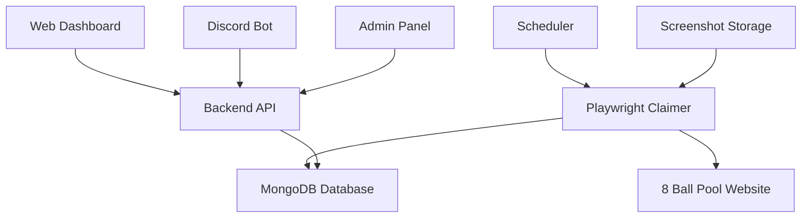

# 🎱 8 Ball Pool Rewards System

<div align="center">


**Automated Daily Rewards Claiming System for 8 Ball Pool**

[](https://nodejs.org/)
[](https://www.typescriptlang.org/)
[](https://reactjs.org/)
[](https://www.mongodb.com/)
[](https://discord.com/)

</div>

---

## 🚀 **What This System Does**

The **8 Ball Pool Rewards System** is a comprehensive full-stack platform that automatically claims daily rewards for registered users on the 8 Ball Pool website. It features a web dashboard, Discord bot integration, automated scheduling, and a robust duplicate detection system.

### ✨ **Key Features**

- 🤖 **Automated Daily Claims** - Claims rewards automatically for all registered users
- 📊 **Real-time Dashboard** - Web interface showing leaderboards, statistics, and admin controls
- 🔔 **Discord Integration** - Bot notifications and user management
- 🛡️ **Duplicate Protection** - 4-layer system preventing duplicate claims
- 📱 **Admin Panel** - Complete system management and monitoring
- 📸 **Screenshot Capture** - Visual confirmation of all claims
- 🔄 **Scheduled Automation** - Cron-based automated claiming
- 📈 **Analytics** - Detailed statistics and reporting

---

## 🏗️ **System Architecture**



### **Core Components**

| Component | Technology | Purpose |
|-----------|------------|---------|
| **Frontend** | React + TypeScript | User dashboard and admin interface |
| **Backend API** | Node.js + Express | REST API and data management |
| **Database** | MongoDB | User data and claim records |
| **Automation** | Playwright | Browser automation for claiming |
| **Discord Bot** | Discord.js | User notifications and management |
| **Scheduler** | node-cron | Automated daily claiming |

---

## 🎯 **How It Works**

### **1. User Registration**
- Users register via Discord bot with their 8 Ball Pool ID
- System validates and stores user credentials
- Users receive confirmation and instructions

### **2. Automated Claiming**
- **Scheduled Runs**: Daily automated claims at set times
- **Manual Triggers**: Admin can trigger claims manually
- **Browser Automation**: Playwright opens browsers and claims rewards
- **Screenshot Capture**: Visual proof of each claim

### **3. Duplicate Protection**
- **Layer 1**: Database-level duplicate prevention
- **Layer 2**: Webpage state detection (button analysis)
- **Layer 3**: Pre-save validation (item count check)
- **Layer 4**: API-level deduplication (aggregation pipelines)

### **4. Data Management**
- **Claim Records**: All claims stored with timestamps and details
- **Leaderboards**: Real-time rankings and statistics
- **Analytics**: Success rates, failure analysis, and trends

---

## 📚 **Documentation**

Comprehensive documentation is available in the [`docs/`](./docs/) directory:

- **[File Structure](./docs/FILE_STRUCTURE.md)** - Complete file structure with descriptions and path explanations
- **[Technical Deep Dive](./docs/README.md)** - Complete system architecture and implementation details
- **[Host Setup](./docs/HOST_SETUP.md)** - Host-based deployment guide
- **[Cloudflare Tunnel](./docs/CLOUDFLARE.md)** - Secure public access setup
- **[Environment Setup](./docs/ENV_SETUP_GUIDE.md)** - Configuration guide
- **[Deployment Checklist](./docs/DEPLOYMENT_CHECKLIST.md)** - Production deployment steps
- **[Discord Setup](./docs/DISCORD_SETUP.md)** - Bot configuration
- And more in the [`docs/`](./docs/) folder

## 📊 **Dashboard Features**

### **Public Leaderboard**
- 🏆 **User Rankings** - Top players by items claimed
- 📈 **Statistics** - Total players, claims, items, and failed claims
- 🔍 **Search & Filter** - Find specific users or timeframes
- 📅 **Time Periods** - View data for different time ranges

### **Admin Panel**
- 👥 **User Management** - View and manage registered users
- 🎮 **Manual Claims** - Trigger claims manually for testing
- 📸 **Screenshot Gallery** - View all captured screenshots
- 📊 **System Monitoring** - Real-time system status and logs
- 🔧 **VPS Terminal** - Direct server access for advanced users

---

## 🛠️ **Technical Stack**

### **Frontend**
- **React 18** - Modern UI framework
- **TypeScript** - Type-safe development
- **Tailwind CSS** - Utility-first styling
- **Framer Motion** - Smooth animations
- **Axios** - HTTP client for API calls

### **Backend**
- **Node.js** - Runtime environment
- **Express.js** - Web framework
- **TypeScript** - Type-safe server code
- **MongoDB** - Document database
- **Mongoose** - MongoDB object modeling

### **Automation**
- **Playwright** - Browser automation
- **Browser Pool** - Concurrent browser management
- **Screenshot Capture** - Visual confirmation system

### **Integration**
- **Discord.js** - Discord bot framework
- **node-cron** - Task scheduling
- **Telegram API** - Notification service

---

## 🚀 **Quick Start**

### **Prerequisites**
- Node.js 18+
- MongoDB 6.0+
- Discord Bot Token
- Telegram Bot Token (optional)

### **Installation**

1. **Clone the repository**
   ```bash
   git clone https://github.com/BlakeMcBride1625/8bp-rewards-v2.git
   cd 8bp-rewards-v2
   ```

2. **Install dependencies**
   ```bash
   npm install
   cd frontend && npm install && cd ..
   ```

3. **Environment setup**
   ```bash
   cp .env.example .env
   # Edit .env with your configuration
   ```

4. **Database setup**
   ```bash
   # Start MongoDB service
   sudo systemctl start mongod
   
   # Run database setup
   node scripts/setup-database.js
   ```

5. **Build and start**
   ```bash
   npm run build
   npm start
   ```

### **Environment Variables**

```env
# Database
MONGO_URI=mongodb://localhost:27017/8bp-rewards

# Discord
DISCORD_TOKEN=your_discord_bot_token
DISCORD_CLIENT_ID=your_discord_client_id
DISCORD_CLIENT_SECRET=your_discord_client_secret

# Telegram (optional)
TELEGRAM_BOT_TOKEN=your_telegram_bot_token
TELEGRAM_CHAT_ID=your_telegram_chat_id

# Security
SESSION_SECRET=your_session_secret
JWT_SECRET=your_jwt_secret

# Admin
ADMIN_DISCORD_IDS=admin1,admin2,admin3
VPS_OWNERS=owner1,owner2,owner3
```

---

## 📚 **Documentation**

- 📖 **[Complete Documentation](docs/README.md)** - Detailed setup and configuration guide
- 📋 **[Documentation Index](docs/index.md)** - Quick reference for all docs
- 🔧 **[Shell Scripts](docs/shell.md)** - Utility scripts and automation tools
- 🗄️ **[MongoDB Setup](docs/MONGODB_SETUP.md)** - Database configuration guide
- 🤖 **[Discord Setup](docs/DISCORD_SETUP.md)** - Bot configuration and commands

---

## 🔧 **System Services**

The system runs as multiple services:

| Service | Description | Status |
|---------|-------------|--------|
| **Backend API** | Express server handling requests | `systemctl status 8bp-rewards-backend` |
| **Discord Bot** | Bot for user management and notifications | `systemctl status 8bp-rewards-discord` |
| **Scheduler** | Automated claiming service | `systemctl status 8bp-rewards-scheduler` |

### **Service Management**
```bash
# Start all services
sudo systemctl start 8bp-rewards-backend
sudo systemctl start 8bp-rewards-discord
sudo systemctl start 8bp-rewards-scheduler

# Check status
sudo systemctl status 8bp-rewards-*

# View logs
sudo journalctl -u 8bp-rewards-backend -f
```

---

## 📈 **Monitoring & Analytics**

### **Real-time Metrics**
- **Total Users**: Registered players count
- **Success Rate**: Percentage of successful claims
- **Daily Claims**: Number of claims per day
- **Failed Claims**: Failed attempts tracking

### **Leaderboard Data**
- **User Rankings**: Top players by items claimed
- **Time Periods**: 7 days, 30 days, all time
- **Success Rates**: Individual user performance
- **Claim History**: Detailed claim records

---

## 🛡️ **Security Features**

- **Admin Authentication** - Discord-based admin verification
- **VPS Access Control** - Restricted server access
- **Session Management** - Secure user sessions
- **Rate Limiting** - API protection against abuse
- **Input Validation** - Sanitized user inputs

---

## 🔄 **Automation Features**

### **Scheduled Claims**
- **Daily Automation** - Claims run automatically
- **Configurable Times** - Set custom claim schedules
- **Manual Override** - Admin can trigger claims anytime
- **Error Handling** - Robust error recovery

### **Browser Management**
- **Concurrent Browsers** - Multiple simultaneous claims
- **Resource Optimization** - Efficient browser pool management
- **Screenshot Capture** - Visual confirmation system
- **Cleanup Automation** - Automatic file cleanup

---

## 📱 **Discord Bot Commands**

| Command | Description | Usage |
|---------|-------------|-------|
| `/register` | Register for automated claims | `/register <8bp_id>` |
| `/status` | Check your claim status | `/status` |
| `/leaderboard` | View current leaderboard | `/leaderboard` |
| `/help` | Get help and information | `/help` |

---

## 🎮 **Admin Commands**

| Command | Description | Access Level |
|---------|-------------|--------------|
| **Manual Claim All** | Trigger claims for all users | Admin |
| **Manual Claim Single User** | Trigger claim for specific user ID | Admin |
| **Manual Claim Test Users** | Quick claims for pre-configured test users | Admin |
| **User Management** | View/manage users | Admin |
| **System Status** | Check service status | Admin |
| **VPS Terminal** | Server access | VPS Owner |

### **Manual Claim Options**

The Admin Dashboard now supports multiple manual claim options:

1. **Claim All Users** - Processes all registered users (original functionality)
2. **Single User Claim** - Enter any user ID to claim for just that user
3. **Test User Quick Claims** - Pre-configured buttons for common test users

**Test Users Configuration:**
- Configure test users via `TEST_USERS` environment variable
- Default test users: `1826254746`, `3057211056`, `110141`
- Format: JSON array with `id`, `username`, and `description` fields

---

## 🐛 **Troubleshooting**

### **Common Issues**

1. **Claims Not Working**
   - Check browser concurrency settings
   - Verify MongoDB connection
   - Review Playwright browser setup

2. **Discord Bot Offline**
   - Verify Discord token
   - Check bot permissions
   - Review service status

3. **Database Connection Issues**
   - Confirm MongoDB is running
   - Check connection string
   - Verify network access

### **Logs & Debugging**
```bash
# Backend logs
sudo journalctl -u 8bp-rewards-backend -f

# Discord bot logs
sudo journalctl -u 8bp-rewards-discord -f

# Scheduler logs
sudo journalctl -u 8bp-rewards-scheduler -f
```

---

## 🤝 **Contributing**

1. Fork the repository
2. Create a feature branch (`git checkout -b feature/amazing-feature`)
3. Commit your changes (`git commit -m 'Add amazing feature'`)
4. Push to the branch (`git push origin feature/amazing-feature`)
5. Open a Pull Request

---

## 📄 **License**

This project is licensed under the MIT License - see the [LICENSE](LICENSE) file for details.

---

## 👨‍💻 **Author**

**Blake McBride**
- GitHub: [@BlakeMcBride1625](https://github.com/BlakeMcBride1625)
- Discord: BlakeMcBride#1625

---

## 🙏 **Acknowledgments**

- **8 Ball Pool** - For providing the rewards system
- **Playwright** - For excellent browser automation
- **Discord** - For bot platform and API
- **MongoDB** - For reliable data storage
- **React** - For the modern frontend framework

---

<div align="center">

**⭐ Star this repository if you found it helpful!**

[](https://github.com/BlakeMcBride1625/8bp-rewards-v2/stargazers)

</div>